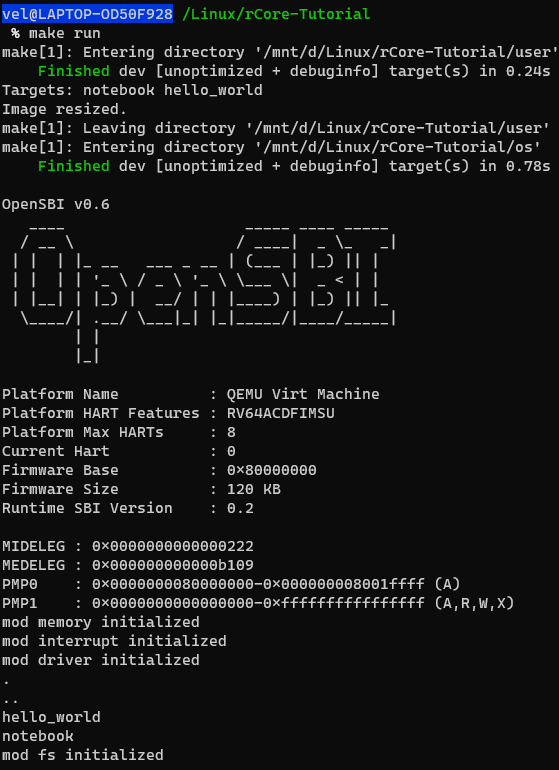

# 总体进度

博客记录：[操作系统暑期项目](https://vel.life/%E6%93%8D%E4%BD%9C%E7%B3%BB%E7%BB%9F%E6%9A%91%E6%9C%9F%E9%A1%B9%E7%9B%AE/)

## step0

#### rustings练习题

https://github.com/stellarkey/os_summer_project/tree/master/rust%20exercise/rustlings/exercises

#### 编程练习题

https://github.com/stellarkey/os_summer_project/tree/master/rust%20exercise/coding

## step2

实验报告总览：[操作系统暑期项目 - rCore阶段](https://vel.life/%E6%93%8D%E4%BD%9C%E7%B3%BB%E7%BB%9F%E6%9A%91%E6%9C%9F%E9%A1%B9%E7%9B%AE/#rCore)

> 实验报告源代码放至：https://github.com/stellarkey/os_summer_project/tree/master/rcore_project

分阶段代码库：[lab0](https://github.com/stellarkey/os_summer_project/tree/master/rcore_project/lab0)，[lab1](https://github.com/stellarkey/os_summer_project/tree/master/rcore_project/lab1)，[lab2](https://github.com/stellarkey/os_summer_project/tree/master/rcore_project/lab2)，[lab3](https://github.com/stellarkey/os_summer_project/tree/master/rcore_project/lab3)，[lab4](https://github.com/stellarkey/os_summer_project/tree/master/rcore_project/lab4)，[lab5](https://github.com/stellarkey/os_summer_project/tree/master/rcore_project/lab5)，[lab6](https://github.com/stellarkey/os_summer_project/tree/master/rcore_project/lab6)。

实验题目录：[lab1实验](https://github.com/stellarkey/os_summer_project/tree/master/rcore_project/lab1-practice)，[lab2实验](https://github.com/stellarkey/os_summer_project/tree/master/rcore_project/lab2-practice)，[lab3实验](https://github.com/stellarkey/os_summer_project/tree/master/rcore_project/lab3-practice)，[lab4实验](https://github.com/stellarkey/os_summer_project/tree/master/rcore_project/lab4-practice)，[lab6实验](https://github.com/stellarkey/os_summer_project/tree/master/rcore_project/lab6-practice)。

# 7.4 rust语言启程

> [Rust by Example](https://doc.rust-lang.org/rust-by-example/)
>
> [Rust 程序设计语言](https://kaisery.github.io/trpl-zh-cn/)
>
> 《Rust编程之道》

第一天的精力并没有集中到rust的学习上，这是比较尴尬的。现在已经下午6点了，~~我在做什么~~。

看了看，需要先入门语法，大概两天。

> 通过阅读和练习 [《 Rust by Example 》](https://doc.rust-lang.org/rust-by-example/))  ，全面梳理一遍 Rust 语法。~~没想到是全英文~~。

通过这本书的开头，rust语言的最大特点似乎是内存管理回收的安全性，我想想，这不跟java一样吗？[查了一下](https://www.easemob.com/news/4837)，好吧，我看错了，是 **without** garbage collection. QAQ. 大概**rust的编程会比java更加安全和简单**。

---

同时我也在考虑如何组织每日学习记录和博客的关系，决定将具体内容放到博客连载，这里只提供简单的记录和项目内容备份。

---

好，先开始消化推荐资料。

---

想到要先安装环境。

windows安装速度龟速，并且反复失败。

想到采用虚拟机。

搜索到：[Docker与VM虚拟机的区别](https://zhuanlan.zhihu.com/p/74491259)。

# 7.5 rust语法学习

装好了Hyper-V上的Ubuntu虚拟机。

感觉Hyper-V有点难用。转VMware。

> VMWare又折腾了一波。

趁着装环境，学习一下rust语法。感觉rust by example还是很细节的。

----

windows安装rust成功！虚拟机搭好了，但是没装rust。等之后再说吧。

---

Hello world运行成功！

---

Hello cargo。

---

linux里还是装不上，网络爆炸。

> linux装上了rust。装VSCode。

---

详细内容整理到博客中。

# 7.6 继续学习rust语法

作用域：第一次感觉到rust的一些不一致性。虽然rust可能在纲领上统一，但是在底层接口的设计却不一定完全一致。比如：

```rust
println!("{:?}", a = b);   // 注意这里的 a = b不是赋值，而是输出转移，a本身的值不变
```

# 7.7 荒废

# 7.8 荒废

~~诶呀不能再荒废了！~~

~~下定决定明天开始肝！~~

# 7.12 重启

惭愧惭愧。然时维不逆。

左思右想，觉得仍有必要认真学习一番rust语言。至于OS相关的内容，则听天由命，不再强求了。

https://github.com/rust-lang/rustlings的编程小练习看了一下，是改错型的练习。

> The task is simple. Most exercises contain an error that keep them from compiling, and it's up to you to fix it!

clone该项目。通过manually方式安装rustling。完毕。

然而rust语言的基本学习还需加强。继续看rust相关的书籍和资料。

开始一边练习rustling，一边学习rust语言。

> 结构体&str非要加个lifetime parameter就很着急。~~好吧还有String~~。

https://rustwiki.org/zh-CN/rust-by-example还是中文版好看一点。。

https://doc.rust-lang.org/reference/introduction.html官方的解析比较全面感觉。

---

做到rustlings错误处理部分的练习时明显感觉到知识储备的不足。需要和学习语言交替进行。

---

**观看OS实习第一次交流会**。

> 陈向群老师：不忘初心啊！自我管理。完善学习方法。踏实，做好记录，善于总结。
>
> 向勇老师：提供了本课程的调查问卷数据分析。去鹏城实验室的概率波动较大，但线上全程参与是完全可行的。**只要自己有收获就行了**。
>
> 李睿老师：鹏城实验室负责老师。两位助教目前正在实地配置环境。5位分享同学。
>
> > 方澳阳：之前没有了解过。有一定计组基础。开始整天赶进度学习。后面改为每日6小时学习。语法改错，编译器比较智能。然后开始RISC-V的相关学习。**语法、理论、实践<font color=red>交替进行</font>**。
> >
> > 林可：刚刚入坑。C语言和汇编有一定经验。多线程有基础。看过一些OS资料。每天投入6-7个小时。按自己的节奏来学习。不要着急。
> >
> > 蒋周齐（洛佳）：rust社区资深人士。rust有特殊的难度，需要花时间克服。rust运行时小，性能好。有rust嵌入式方向的经验。做操作系统方面经验有限。以前翻译过《[用rust写操作系统](https://github.com/rustcc/writing-an-os-in-rust)》。rust语言一直在迭代。**rust的宏十分强大灵活**。这几天主要在看OS的代码。**写OS特别需要调试代码的技巧**。
> >
> > 卢弘毅：准备了一个经验分享pdf。Lab的准备内容（rust、RISC-V、OS、github）。lab教程代码一定要敲一遍。多多在github上提issue和PR。**单元测试**。警惕自动化，rust有相当多特性，但有时会在debug时带来很多困扰。
> >
> > 车春池：rust语言集中看了几天后，开始交替学习。RISV-V某文档第十章**特权架构**（[Manual](https://riscv.org/specifications/privileged-isa/)）。LAB1没有实现中断描述符。在rcore中实现了IDT的数据结构。**在实践中理解rust语言**。
>
> 张汉东老师：rust语言分享。一定要有整体的把握。**rust语言集众家之长**（基于类型系统的集成）。解决未来互联网的**安全**问题（类型安全）。C++性能高，但类型不安全（[如何理解编程语言的类型安全性？](https://www.zhihu.com/question/35532790)）。**Safe rust**相比于Safe C的安全性更显然、易差错（不会出现未定义行为）。trait是类型行为的抽象。字符串的设计（为什么这么多种字符串）也是为了保证类型安全，比如`&str`胖指针。合类型（enum）与集类型（struct）。【讲的比较细节，没跟上】
>
> > https://www.bilibili.com/video/BV1ti4y1b7xy
>
> 王润基：第二阶段zCore的助教。18年开始探索rust写OS。一定要**边做边学**。勇敢地面对Unsafe。生命周期比较头疼，不要死磕。rust不鼓励全局变量。
>
> 吴一凡：rust现代化、易用。边做实验边学习，重点学习系统是如何搭起来的，一开始不用纠结具体实现。多总结，在不同场景下的应用等等。
>
> 最后总结了一下第二阶段的相关安排。

---

观看[王润基：RUST OS开发历程与心得体会](https://cloud.tsinghua.edu.cn/f/530d03a556394fc6882c/)。

---

找到一个很好的教程：[Rust 基础教程](https://www.twle.cn/c/yufei/rust/rust-basic-index.html)。

---

观看张汉东老师讲座：[GeekPie WorkShop#7「关于Rust你需要了解的…」](https://www.bilibili.com/video/BV1ti4y1b7xy)。

# 7.13 rustings做完辣

今天没做太多东西、

把昨天没做完的rustings做完了 ：）。

> 题解目录：https://github.com/stellarkey/os_summer_project/tree/master/rust%20exercise/rustlings/exercises

对rust语言有了一些不一样的理解。

至少，敢去写一点代码了。

rust的语言特性是如此纷繁，以至于学习它会对学习其他语言起到悠久的影响。

# 7.14 风轻云淡的一天

静下心来读了读《Rust 编程之道》的第二章。这时候回过头来看，感受有些不同。

---

玩了一下午游戏。惭愧。

---

有点累，写不动代码了。只好再看看书。

明天争取开始看一点RISC-V和rCore的内容，然后写点rust算法题。

看了看rust生命周期更细致的一些内容，逐渐感觉到学海无涯。

也许要积累一些常用rust STL的总结，如果要写算法题的话。

# 7.15 rust算法题

写得很绝望。感觉白学了。

---

算法题总算做了15道。虽然整体难度不高。但是。还算是有所收获。

算法练习记录见：https://github.com/stellarkey/os_summer_project/tree/master/rust%20exercise/coding

---

博客更新地址：https://vel.life/%E6%93%8D%E4%BD%9C%E7%B3%BB%E7%BB%9F%E6%9A%91%E6%9C%9F%E9%A1%B9%E7%9B%AE/

> 因为博客本地操作有些问题。所以会更新不及时。近期会抽空解决。

## 完成情况

- [x] 15道编程题

## 预期计划

- 考虑一下更优秀的记录方式，~~不要再记流水账了~~。。
- 开始入门RISC-V。
- 深入学习Rust的标准库和高级特性，然后有时间就挑战一下更难的编程题。
- 开始看rCore的lab。

# 7.16 学习RISC-V和了解rCore

## 事件1 环境配置

- 安装windows qemu。配置环境变量。
- 安装windows WSL 2 & Terminal，并按指导书重新安装在WSL上的rCore生产环境。
- 越整越麻烦。。
- WSL坑太多。整了一天。
- 在经过漫长的鏖战以后，终于，`make run`成功了！



## 事件2 学习RISC-V

- 回顾x86体系。
- 阅读RISC-V相关资料。特权级、寄存器……

## 事件3：浏览其他同学的Daily

挨个看了一遍。有的同学一开始就已经是rust、OS的老手，每天做的工作早就开始写操作系统；有的同学刚入门；有的同学做lab快要完成；有的同学进度一般；还有的同学中途放弃。

一些我遇到的问题和没遇到的问题，都在其他同学的Daily找到了一些映证。

## 预期计划

明天开始边做实验，边看RISC-V，边抽空深入学习rust语言。

# 7.17

## 事件1：弄lab0

- 装gdb。
- 装Xserver调试图形界面。因为GDB调试、QEMU很可能无法避免得要用到图形界面。
- 装gdb-dashboard。
- 实际上lab0还没开始。。

## 事件2：Go语言

心血来潮看了一点Go语言，Go语言也是系统编程级语言，也是现代语言，也许跟Rust有一些相似性。至少从目前看来，它们的创新特点有很多类似的地方。

## 预期计划

现在各种工具应该差不多了。万事俱备，只欠东风。

# 7.18 lab0

只做了一点点lab0。。

# 7.19 摸鱼

今天又摸鱼辣。只做了一点点lab0。

然后看了第二次分享会。具体的内容都放到博客里面了。

# 7.20 轻度摸鱼

## 事件1：摸鱼

有别的事情辣。比如学习驾驶。

## 事件2：rCore-Tutorial的PR处理

- 昨天对WSL2相关的内容进行了PR
- 今天被打回来QAQ，一堆格式不规范
- 重新照着格式修改了一遍
- 希望可以review通过吧 qwq我好难

# 7.21 lab0完成

## 事件1：rCore-Tutorial的PR通过

- 通过辣
- 7.22发现只是通过了，后来又被重新优化了一遍

## 事件2：lab0

- 疯狂做完
- 然而教程中内容太多，可能一时记不下来

## 事件3：RISC-V特权架构

- 看http://crva.ict.ac.cn/documents/RISC-V-Reader-Chinese-v2p1.pdf的第十章。
- 

## 事件4：lab1

- 中断的内容以前学OS就知道了。所以较为友好。
- 但是没看多少。寄存器有点多，一下记住很难。

# 7.22 lab1

## 事件1：划水

- 学习驾驶。

## 事件2：lab1

- 开始手敲lab1的代码（~~照着抄~~）
  - 手敲了一部分。。又拷贝了一部分。。
- 发现了一些BUG，修正
- 又提交了PR。
- lab1算是搞完了吧？。。。

## 事件3：lab2

- 开个头。

# 7.23 lab2

## 事件1：lab2

- 开始看动态内存分配的东西。
- 本质上跟ucore的逻辑差不多。。
- 物理内存管理的代码量确实挺大。
- 涉及到的代码太多了，一步一步手写代码实现实在是难以实现。因此开始大量copy里面的板子，比如algorithms以及各个模板。先跑通再说。如果这里不符合要求，那么也只能如此了。
- 跑通了。

## 预期计划

- 要开始看看实验题了
- 明天lab3一定要跑通啊~~~QAQ

# 7.24 lab3、lab4

## 事件1：结束事件突然提前

- 突然提前到26号结束。
- 这样不得不肝了。

## 事件2：跑通lab3

- 跑通了。代码基本没有手写。

## 事件3：跑通lab4（并没有）

- 来不及搞了。先搞点实验题吧。

> 只能先跑通，然后争取做一点实验题了。

## 事件4：lab1实验题

- 完成实验题。

## 事件5：lab2实验题

- 还剩一道线段树。这个我短时间内真的没时间写了。。只能分析分析现有的代码了。
- 好了，分析了一下已有的线段树实现，发现并没有想象中那么难，自己重新实现了一下，效果还可以。
- 完成了。

# 7.25 ~~肝就完了~~！

## 事件1：lab3实验题

- 开始肝。

## 事件2：跑通lab4、lab5、lab6

- 因为确定直接跑通lab4，所以采用了代码仓库中lab-4分支。
- 没时间自己一点点地抄和找茬了。
- lab5和lab6就不单独再弄了。

## 事件5：lab4实验题

- 水完了、QAQ

## 事件6：lab6实验题

- 

